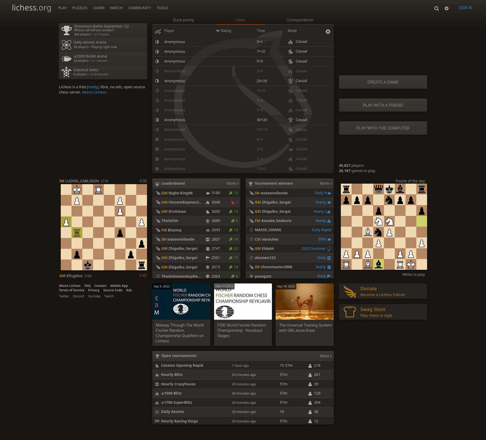
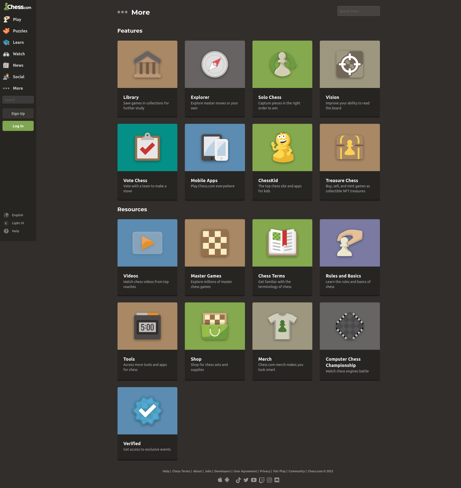

# Cheess
## Main Features
Cheess is a chess program in which users can play the best, most awesome game that is chess. It's feature set will contain all of the handy functions that a typical chess program has but without all of the bloat. These features include players being able to immediately hop into a game either alone, with a buddy locally, or online! Further, Cheess will also have a unique randomizer variant that will result in the wackiest matches ever played! Not only that, but every game will play out differently, thus adding to its replayability! This should guarantee a fun time for everyone, casual or competitive players alike!
## Languages/Frameworks
Chess will run through the Electron framework using Javascript, HTML and CSS. I decided to make my program a desktop application to make getting into a game of chess as quick and seamless as possible. Further, if one would like to play this locally with someone or an AI, it can be run offline. Moreover, I'm familiar with web apps a bit, making this an easier choice to make. [This board](https://chessboardjs.com/) paired with [this library](https://github.com/jhlywa/chess.js) seem like they will be very helpful for my project, so long as they don't simply do all the code I'm supposed to do.
## Competition
Lichess [1] is a very popular chess program for a variety of players. It's a competing program in regards to mine as it is an open source multiplayer chess program. It is under the [AGPL license](https://en.wikipedia.org/wiki/GNU_Affero_General_Public_License). Users can play games with random people, friends and AI. It also offers a coaching system where users can request help from excellent players. Further, users can make an account to track their progress. I plan for my program to be open source as well as letting players play against each other. However, I'm not sure if coaching will be entirely feasible. I won't be making any sort of account system, as I find users can be deterred from a program as soon as it asks them to make one.  Additionally, I believe the average user of a chess program won't need so many features. The myriad of options to choose from only serve to bloat the screen and make it less accessible to some users, like new players just wanting to play a game of chess. This is partly why I've decided to go the desktop app route, so that users can get straight into a game without having to know how to navigate such a webpage.

---

Chess.com [2] is another popular chess program, perhaps even more than Lichess due to the disparity in player count. Lichess, as of this viewing, had 41,000 players compared to chess.com's 216,000. It's feature set is similar to Lichess in that there are a lot of cool tools for experienced users to take advantage of, but to any other user it can just result in confusion. It also requires an account to be set up for a user to play any sort of variant, a feature I will definitely not be making. Users would easily be discouraged from a program if it requires an account to be made to use certain features.
### References

[1] T. Duplessis, “The best free, adless chess server,” lichess.org. [Online]. Available: https://lichess.org/. [Accessed: 18-Sep-2022].

[2] E. Allebest, “Play chess online - free games,” Chess.com. [Online]. Available: https://www.chess.com/. [Accessed: 18-Sep-2022]. 
